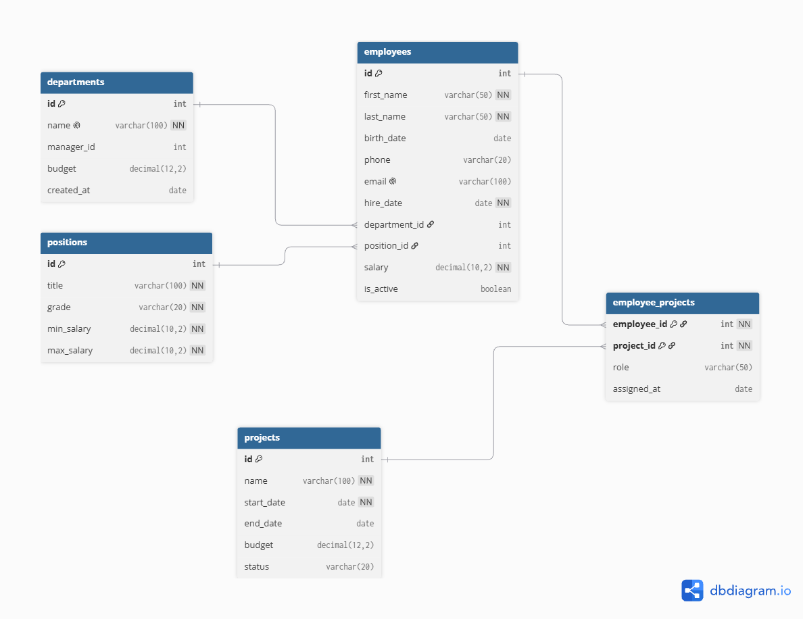

# 🗄 База сотрудников

### 🎯 Проектирование БД, ER-диаграмма, аналитические запросы

Спроектировал и реализовал корпоративную базу данных для HR-отдела: сотрудники, отделы, должности, проекты. Написал 7 аналитических запросов — от простых JOIN'ов до оконных функций и сводных отчётов.

⭐ *Ищу стажировку или Junior-позицию в аналитике данных / SQL-разработке*

---

## 🛠 Стек проекта

---

## 📊 ER-диаграмма

---

## 📋 Мои запросы

| Запрос | Описание | Стек |
| :--- | :--- | :--- |
| [Сотрудники с отделами](queries/1_employees_with_departments.sql) | JOIN трёх таблиц: сотрудник + отдел + должность | SQL |
| [Средняя зарплата по отделам](queries/2_avg_salary_by_dept.sql) | GROUP BY + AVG, COUNT, SUM | SQL |
| [Топ-5 высокооплачиваемых](queries/3_top_paid_employees.sql) | Фильтрация активных, ORDER BY, LIMIT | SQL |
| [Сотрудники на проектах](queries/4_employees_on_projects.sql) | Связь M:N через промежуточную таблицу | SQL |
| [Отделы выше средней ЗП](queries/5_departments_above_avg.sql) | Подзапрос + HAVING, CTE | SQL |
| [Ранг внутри отдела](queries/6_rank_in_dept.sql) | Оконные функции RANK, COUNT OVER | SQL |
| [Сводка по отделам](queries/7_department_summary.sql) | Комплексный отчёт: MIN, MAX, AVG, SUM | SQL |

---

## 🏗 Структура БД

| Таблица | Что хранит | Связи |
| :--- | :--- | :--- |
| `departments` | Отделы компании | 1:M → employees |
| `positions` | Должности и грейды | 1:M → employees |
| `employees` | Сотрудники | M:1 → departments, positions |
| `projects` | Проекты компании | M:N → employees |
| `employee_projects` | Связь сотрудников и проектов | Промежуточная таблица |

**Ключевые решения:**
- 📌 **Внешние ключи** для связей 1:M и M:N
- 📌 **CHECK** на `min_salary <= max_salary` и `status IN (...)`
- 📌 **UNIQUE** на `email` и `name` отдела
- 📌 **ON DELETE CASCADE** для связующей таблицы

---

## 🔍 Что демонстрирует проект

- 📌 **Проектирование БД с нуля** — 5 таблиц, связи 1:M и M:N
- 📌 **JOIN 3+ таблиц** — сотрудники + отделы + должности
- 📌 **Агрегация** — COUNT, AVG, MIN, MAX, SUM с GROUP BY
- 📌 **Подзапросы и HAVING** — сравнение со средней по компании
- 📌 **CTE (WITH)** — вынос повторяющихся подзапросов
- 📌 **Оконные функции** — RANK() OVER (PARTITION BY ...), COUNT() OVER
- 📌 **M:N связь** — через промежуточную таблицу `employee_projects`

---

## 🚀 Как запустить проект

- 📥 Установить MySQL 8.0 и DBeaver
- 🗄 Создать БД: `CREATE DATABASE company_db;`
- 📦 Выполнить `schema.sql` — создаст 5 таблиц
- 📤 Выполнить `seed.sql` — заполнит тестовыми данными
- ▶️ Выполнить любой запрос из папки `queries/`

---

## 📬 Связаться со мной

---

⭐ **Если проект оказался полезным — поставь звезду репозиторию!**